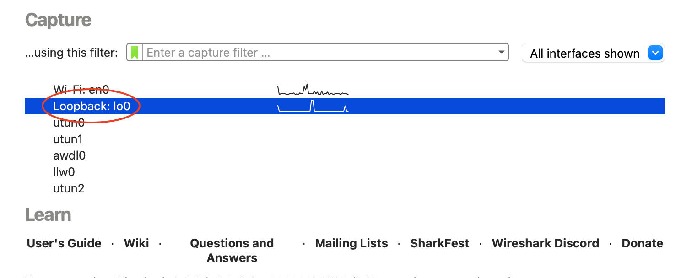
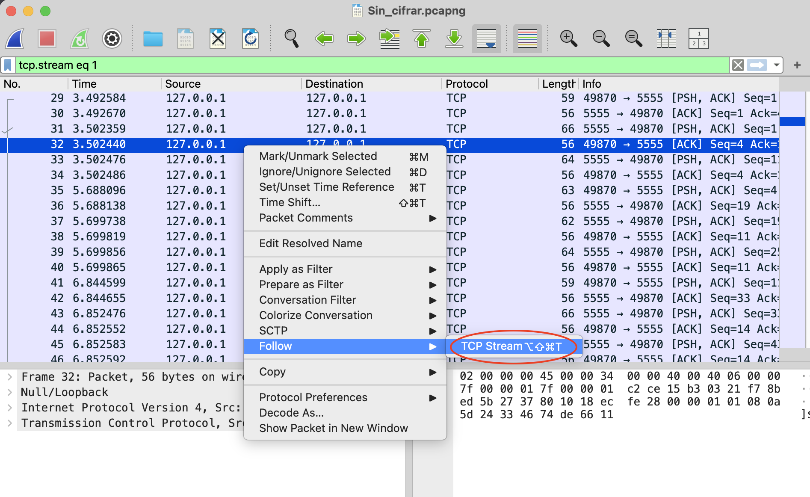
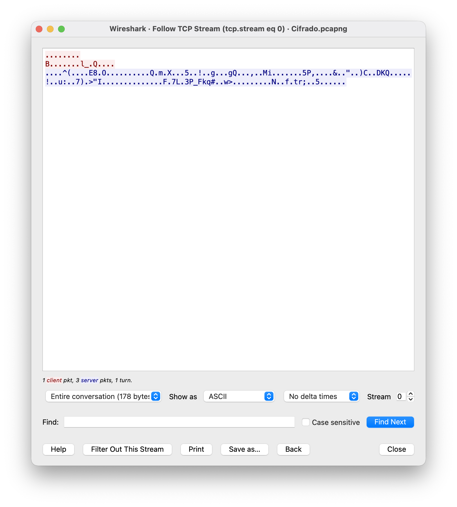
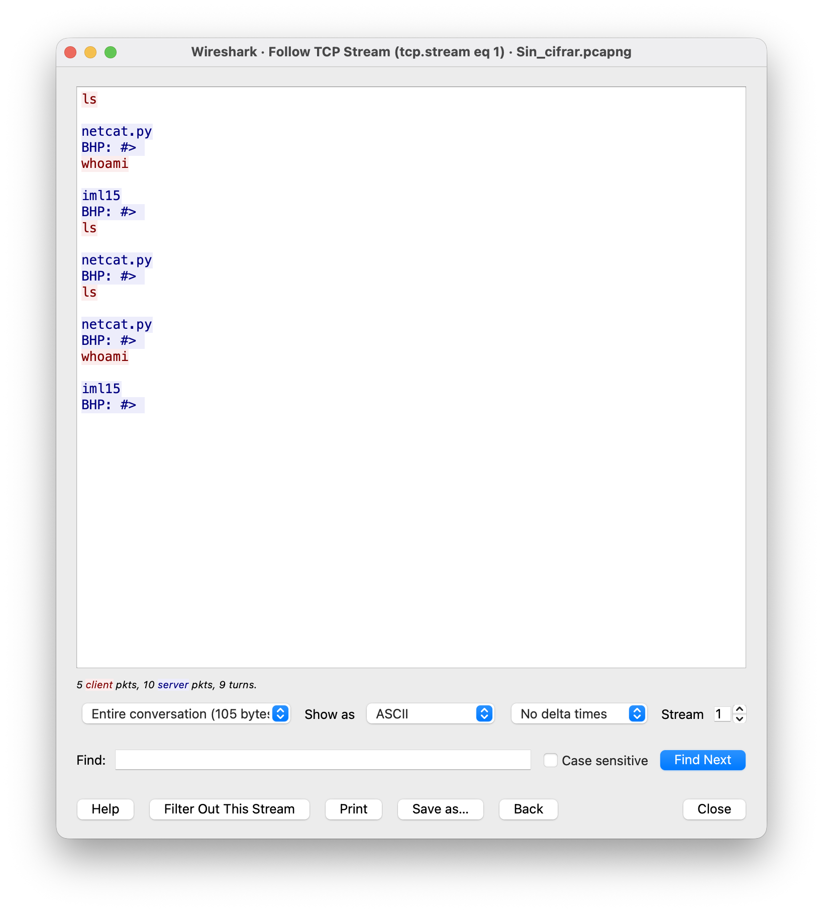

# Netcat.py

*Publication date: 26/4/2026*

> [!NOTE]
> **Iker Marín López (IML15)**
>
> Cybersecurity Engineer (Universidad Rey Juan Carlos)
>
> **Links:** 🔗 [LinkedIn](https://www.linkedin.com/in/iker-marin-lopez-90791b379/) | 🐱 [GitHub](https://github.com/IML15) | 📥 [Telegram](https://t.me/hueco44)


This repository shows a python design which substitutes the famous application 
"Netcat". This practice is really interesting for users who want to
introduce their shelf's into the hacking environment.


> [!WARNING]
> This document has been created for educational purposes in a controlled 
environment. The author is not responsible for any misuse of the information presented herein.

---

## 🔗 ️Encrypted Netcat (BHP Tool with TLS)

A security-enhanced version of the classic Netcat tool implemented in 
Python. This version upgrades the standard communication by wrapping sockets with a TLS 
(Transport Layer Security) layer, preventing credential sniffing and data interception
in transit.

- **Note**: For educational purposes, I have included both `netcat.py` (standard TCP) 
and `netcatTLS.py` (encrypted) in this repository. This allows users to compare 
the two versions using a network analyzer like **Wireshark** and observe the 
transition from plaintext to encrypted traffic.

## Features (netcatTLS.py)

- Encrypted Shell: Interactive command-line access over a secure tunnel.

- Secure File Transfer: Upload and download files with end-to-end encryption.

- TLSv1.3 Support: Utilizes modern cryptographic standards (AES-256-GCM).

- Self-Signed Certificate Support: Custom certificate handling for private environments.

---

## 👾 Setup & Installation

### 1. Generate TLS Certificates

The server requires a certificate and a private key to establish the secure 
tunnel. Use OpenSSL to create a self-signed .pem file:

```bash
openssl req -new -x509 -keyout server.pem -out server.pem -days 365 -nodes
```

### 2. Project Structure

Ensure your directory look like this (or change the file's destination path):

- `netcat_file.py`
- `server.pem`

---
## 💻 Usage

### 1st Server Mode (Listener)

To start a secure listener on all interfaces (using 0.0.0.0 to avoid binding 
errors) with an interactive shell:

```bash
python netcatTLS.py -t 0.0.0.0 -p <PORT> -l -c
```

### 2nd Client Mode

To connect to the listener from the local machine (obviously the port has to 
be the same as the listener):

```bash
python netcatTLS.py -t 0.0.0.0 -p <PORT>
```
After you initialize the client, you have to press `Ctrl + D`(to initialize 
the shell), and then you will be able to interact with the server (**listener**)

---

## 🔐 Security Verification

The encryption has been verified using **Wireshark**. While capturing traffic on the 
loopback interface, the following was observed:

- **Protocol Identification**: Traffic is correctly identified as `TLSv1.2` or 
`TLSv1.3` instead of plain TCP.


- **Handshake**: A successful key exchange occurs using the provided 
`your_file.pem`.


- **Encrypted Payload**: All commands (e.g., `whoami`, `ls`) 
are visible only as `Encrypted Application Data, making them unreadable to 
unauthorized observers.

<br>

### Verification (Wireshark Analysis)

To verify the effectiveness of the TLS implementation, a network traffic
analysis was conducted using Wireshark on the `loopback interface` (because we use
0.0.0.0 as target ip).



<br>

#### 1. Encrypted Application Data

Once the secure tunnel is established, all subsequent traffic is encapsulated. As shown below,
executing a command like `whoami` or `ls` does not reveal any plaintext. The payload is
obscured within **Encrypted Application Data** packets.






- **Protocol**: TLSv1.2 / TLSv1.3.

- **Visibility**: Zero. No commands or shell outputs are readable by an intermediary.

<br>

#### 3. Comparison: Plaintext vs. TLS

The difference is clear when comparing both versions of the tool. In the standard version,
the TCP stream reveals the full interaction. In the TLS version, only high-entropy
(random-looking) binary data is visible.

- `netcat.py`:



- `netcatTLS.py`:


--- 

## 🛠 Technical Stack


- **Python 3.x**: Core logic.


- `ssl` Module: For the TLS context and socket wrapping.


- `socket` & `threading`: For concurrent network communications.


- **OpenSSL**: For certificate management.


